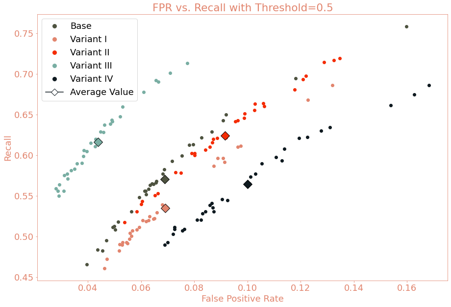

# An Analysis of Account Opening Fraud Utilizing Neural Networks
### Flatiron School Data Science Capstone Project
**Author: [Brandon Sienkiewicz](https://www.linkedin.com/in/brandon-sienkiewicz-data-science/)**

## I. Project Overview

The rise of technology in the modern era has brought about numerous advances that have helped to improve the life and well-being of the general population. This rise in technology has had negative consequences as well. One such consequence is the increase in fraud reports. Transactional fraud is well monitored and has an abundance of public data sets available, allowing for the analysis and improvement of fraud detection methods utilizing concepts such as machine learning. While there is a vast array of information on transactional fraud data, the data available for account opening fraud is limited. Holding a bank account is essential to survive in the modern world and the issue of account opening fraud is becoming more pressing. FiVerity, a cybersecurity company stated that "As much as 50% of new U.S. accounts in 2021 were fraudulent" while the U.S. Department of Labor OIG states that account opening fraud constituted roughly 163 billion dollars of total fraud amounts. [[1]](https://www.bankinfosecurity.com/new-fraud-on-block-causes-bank-losses-to-mount-a-18867) As the issue of account opening fraud becomes more prevalent, so will the need for measures to counteract it. That being said, machine learning provides a strong tool for predictive modeling to combat fraud. My goal for this project was to make predictions for the problem of account opening fraud utilizing deep-learning neural networks.

## II. Data Understanding
 
The data that I utilized for the modeling and analysis was the Bank Account Fraud Dataset Suite [[2]](https://www.kaggle.com/datasets/sgpjesus/bank-account-fraud-dataset-neurips-2022?select=Variant+III.csv), published at the 2022 Conference on Neural Information Processing Systems. The suite of datasets consists of six synthetic account opening fraud data variants based on real-world bank account opening fraud detection data. These variants have differing levels of group disparity and separability for age group, which was split into applicants under the age of 50 and over the age of 50. The base data set is sampling to best represent the original data. Variant I has a higher group size disparity than the base data. Variant II has a higher prevalence disparity than the base data. Variant III has better separability for one of the groups. Variant IV has a higher prevalence disparity in the training data. And finally, Variant V has better separability in the training data for one of the groups. Each data set consists of one million instances, of which 11,029 are denoted as fraudulent. This data is extremely imbalanced, with non-fraudulent instances making up nearly 99 percent of all instances. Due to the imbalanced nature of the data, this could prove to be a challenge for the models.
 

 
## III. Data Preparation
 
The data preparation for this project was fairly simple. The first obvious step was to get an idea of the data types of each feature. Once the data types were determined, any useless features were dropped. The only irrelevant feature in these data sets was `device_fraud_count`, as each instance contained the same value. Next, the `age` feature was split into two groups, above the age of 50 and below the age of 50. It appears that, in general, the occurrence of fraud in the over-50 age group is much higher than the average for the entire data set. This is more pronounced in variants with any type of group disparity.
 

 
Now that the groups have been defined, X variables for each data set were created and categorical features were converted to the object type for preprocessing. The data was then split temporally, as is typical in the fraud space. The training data was defined using the most recent six months of data, `month=[0, 1, 2, 3, 4, 5]`, as the more recent data gives a better representation of the distribution when the model is utilized. The validation data was defined using the seventh month of data, `month=6`, and the testing data was defined using the eighth month of data, `month=7`. The categorical features were then OneHotEncoded and the numerical features were scaled. The resulting data was saved for use in the modeling notebooks. Given the imbalanced nature of the data, oversampling was also conducted with SMOTE to form new scaled and resampled data. The splitting strategy was chosen as 0.25 to not be excessive with the oversampling.
 
 ### Data Engineering (Cross and Polynomial Features)
 
In addition to the normal scaled, resampled data, data using crossed features, the multiplication of two features, and polynomial features, the multiplication of multiple features up to a certain degree, was conducted for the base data set. The process for both of these was similar. First, create the cross features and polynomial features from the numerical features, concatenate the result with the categorical features, conduct a train, test split as mentioned above, apply OneHotEncoding and scaling, and finally, apply SMOTE oversampling. This data engineering was only conducted on the base data set due to time restraints as well as the size of the files created.
 
 

## IV. Data Modelling

### Baseline Model and Initial Process

The modeling process started with the creation of a baseline model. For the baseline model, a dummy classifier model, a model which predicts the majority class every time, was chosen. This model performed very poorly on our performance metric, recall, with a score of only 0.011 which was to be expected, given that it only predicts the majority class. The model chosen for this project was neural networks; therefore, the first iteration of the model was a basic sequential model with only basic dense layers trained on the preprocessed data. For a more thorough description of the model design consult the [Base Modelling Notebook](./Notebooks/02-DataModelling(Base).ipynb). This model performed slightly better with a training recall of 0.023 and validation recall of 0.026. Given that this is the first proper model, it is worth mentioning that, while recall is the performance metric, having a target false positive rate (FPR) is important for this analysis. A high FPR implies that a higher number of applications are getting flagged for fraud when they are non-fraudulent. This can lead to rejected applications and client attrition. That being said, the FPR for both the training and validation data of the first model iteration was essentially zero. While this model would maintain any target FPR given to it, it does a poor job of accurately predicting fraud.
 
The second and third model iterations add dropout layers and class weights respectively. Both of these models failed to pick up on fraud and predicted the majority class every time. This behavior is problematic, as it seems that the models are not able to function for the intended purpose. This is where the data resampled with SMOTE comes in. The fourth model iteration was trained on the resampled data and did a much better job of predicting fraud. The model had a training recall of 0.689 and a validation recall of 0.464 while maintaining an FPR of 0.055 on the training data and 0.044 on the validation data. Since this is the first model to accurately predict fraud, some metrics were determined. First, the ideal class weight was determined by finding the ideal value for `mu`, a constant that scales the class weights. The ideal value for `mu` was found to be 0.2. To get a better idea of how the model will perform given differing target FPRs, a threshold was defined. This threshold is simply the value at which the model predicts fraud. The model gives a probability of the instance being fraudulent. Therefore, specifying a value between zero and one will change what instances are predicted as fraud. The default is 0.5 but we will use 0.1, 0.2, 0.3, 0.4, and 0.5, as decreasing the threshold increases the recall score at the cost of FPR. Training each model on all five thresholds will be done moving forward.
 
 ### Model Tuning
 
For the remainder of the models discussed, the specific metrics will not be mentioned. That being said, the fifth model iteration added some complexity by adding multiple dense layers and an additional dropout layer. This model does not appear to perform better than the fourth iteration and, in some cases, appears to perform worse. For the sixth model iteration, a new approach was taken. The model was stripped back to the structure of the fourth iteration; however, a different activation (SELU) was chosen and the dropout layers were removed in favor of alpha dropout layers. These decisions were made based on the self-normalizing properties of SELU and alpha dropout layers. This iteration performed fairly well and gave more consistent results; therefore, future iterations will be built on this model.

The seventh model iteration adds L2 regularization for further regularizing properties. This model appears to improve on the previous model iteration, though is slightly underfit for higher threshold values. The eighth model sought to remedy this by adding more complexity in the form of two additional dense layers and one additional alpha dropout layer. This model performed well in general and did not appear to be too overfit or underfit. The ninth model iteration updated the value for L2 regularization from the default of 0.01 to 0.005 to get a better fit. This did not appear to have a significant impact on model performance. The final model chosen was the eighth iteration due to its solid metrics and consistent performance.
 
#### Data Engineering (Base Data Set Only)
 
While the work with data engineering was not extensive, it is worth briefly mentioning. Some basic models were run with the cross-feature data and polynomial feature data with some decent results. Further model tuning could prove that the data engineering provided a better final model; however, due to time restraints, these engineered data sets were not thoroughly tested.
 
#### Data Variant V
 
Due to the nature of the Variant V data set, it did not end up being included in the final model and analysis. The model did not perform in the same way as the other five data sets and required differing oversampling and threshold strategies. Considering that the goal was to find a general model, this data set was excluded due to time limitations. Further model tuning could yield a model that works well with this data set.
 
### Final Model
 
As mentioned above, the eighth iteration of the model was chosen for its reliability. A class `final_model` was created with a function `run_evaluate` to conduct optimal model training. To counter the stochastic nature of the algorithm each model was run 30 times and the results were averaged. This process was conducted for all of the data sets, aside from Variant V, and the results were compiled into various variables and visualizations. The results of the training process can be seen in the visualization below.
 

 
## V. Evaluation and Conclusions
 
Overall, the final model performance varied based on each data set. The final results of the model with a threshold of 0.5 can be seen above. Variant III performed the best, with the second-highest recall score and lowest FPR score. This data set used synthetic features to have better separability for one of the groups. Given these results, it appears that the addition of synthetic features can have a positive impact on model performance; however, more evidence is required to back this claim. In terms of FPR, all of the models were at or below roughly ten percent. This is a good baseline FPR rate, as there would not be an excessive number of flagged false positives. When comparing the threshold to FPR and recall score, it appears that as the threshold value decreases, the FPR and recall score increase. The relationship is further emphasized in the visualization below, which shows the average FPR and recall across all data sets for each threshold value. While a higher recall score is the desired outcome, an increased FPR could cause the model to exceed a target FPR and would cause more instances to be flagged. The more applications that are flagged and rejected, the higher the rate of client attrition. An analysis of costs of attrition versus the cost of account opening fraud cases could help identify what the ideal threshold would be; however, this analysis would vary from financial institution to financial institution.
 

 
In conclusion, the most ideal use of this model would be as an initial screening. The application would be run through the model and, if identified as fraud, would be flagged. To prevent the rejection of every fraudulent prediction, the utilization of fraud analysts to quickly review flagged applications could help greatly reduce the rate of rejected applications while simultaneously catching the same amount of fraud cases. Again, the value of this process would need to be determined via cost analysis. While the project had various limitations, limited time, lack of extensive analysis regarding protected attributes, and the use of limited machine learning algorithms, it provides a good baseline for the detection of account opening fraud. Further time and research will yield better models and more complicated techniques required to combat this complex problem.
## Contact

* **[LinkedIn Profile](https://www.linkedin.com/in/brandon-sienkiewicz-data-science/)**
* **[Email Address](bmsienk@outlook.com)**

## Repository Structure

* [Images](./Images) 
 (Folder containing visualizations for the presentation/readme)
 
* [Notebooks](./Notebooks)
 (Folder containing all jupyter notebooks used for this project)
 
  * [Data Prep](./Notebooks/01-DataPrep.ipynb) (Data prep and train/validation/test file creation)
  * [Data Modelling (Base)](./Notebooks/02-DataModelling(Base).ipynb) (Contains all details for the models used for all data sets)
  * [Data Modelling (Variant I)](./Notebooks/03-DataModelling(VariantI).ipynb) (Models from base applied to variant I)
  * [Data Modelling (Variant II)](./Notebooks/04-DataModelling(VariantII).ipynb) (Models from base applied to variant II)
  * [Data Modelling (Variant III)](./Notebooks/05-DataModelling(VariantIII).ipynb) (Models from base applied to variant III)
  * [Data Modelling (Variant IV)](./Notebooks/06-DataModelling(VariantIV).ipynb) (Models from base applied to variant IV)
  * [Data Modelling (Variant V)](./Notebooks/07-DataModelling(VariantV.ipynb)) (Models from base applied to variant V)
  * [Final Model Results and Analysis](./Notebooks/08-FinalModelResultsAnalysis.ipynb) (Final Model training, results, and analysis)
 
 * [.gitignore](./.gitignore)
 
 * [README](./README.md)
 
 * [Fuctions Script](./functions.py) (A python script containing useful functions utilized for this project)
 
 * [Presentation](./presentation.pdf) (Final presentation slides)

## Work Sited

* **Jesus, Sérgio and Pombal, José and Alves, Duarte and Cruz, André and Saleiro, Pedro and Ribeiro, Rita P. and Gama, João and Bizarro, Pedro**. *Turning the Tables: Biased, Imbalanced, Dynamic Tabular Datasets for ML Evaluation*. arXiv (2022). [https://doi.org/10.48550/arxiv.2211.13358](https://doi.org/10.48550/arxiv.2211.13358).
